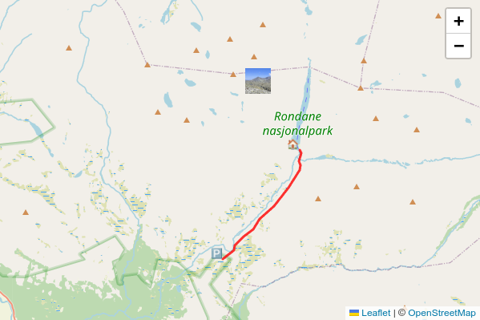

# mdx_map

Markdown extension for annotating interactive Leaflet/OpenStreetmap maps.

# Example

This Markdown..

```
<map>
"settings": {
  "initial-lat": "61.87492817694598",
  "initial-lng": "9.744873046875002",
  "initial-zoom": "11",
  "width": "600px",
  "height": "400px"
},
"markers": [
  {
    "name": "Spranget",
    "lat": "61.83489",
    "lng": "9.7312",
    "html": "🅿️"
  },
  {
    "name": "Rondvassbu",
    "lat": "61.87897",
    "lng": "9.79621",
    "html": "🏠️"
  },
  {
    "img-src": "thumbnail.png",
    "url": "large_photo.jpg",
    "lat": "61.90663270777034",
    "lng": "9.76066589355469"
  }
],
"routes": [
  {
    "gpx-url": "Spranget - Rondvassbu.gpx",
    "color": "red"
  }
]
</map>
```

Results in..




## Example code

```python
import markdown
import mdx_map

md = markdown.Markdown(
	extensions = [
		markdown_inline_map.makeExtension()
	]
)

return md.convert(<string>)
```
